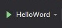

# Hello World

<!-- Banner -->

    

<!-- First badges -->

  <!-- Codacy -->
 
  <!-- Last commit -->
  
  <!-- Repo size -->
  

<!-- Seconds badges -->

  <!-- Contributors -->
  
  <!-- Language -->
  
  <!-- License -->
  

## Using

-   .NET Core 3.1

## Get Started

* * *

Copyright © Mir Carvalho 2021
